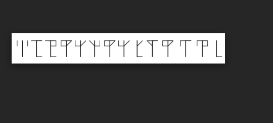
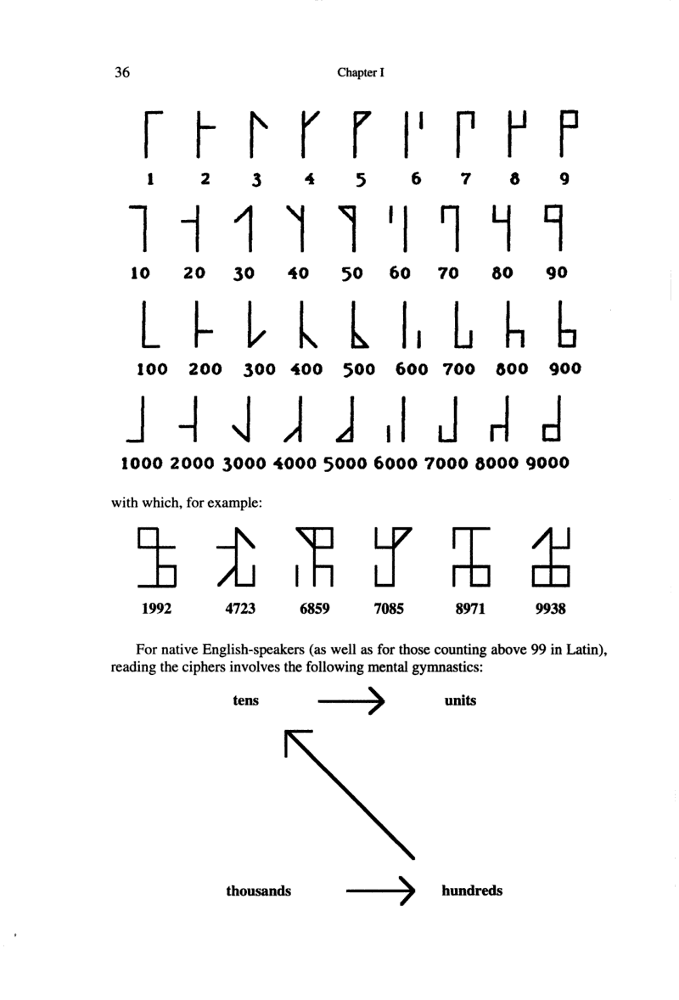
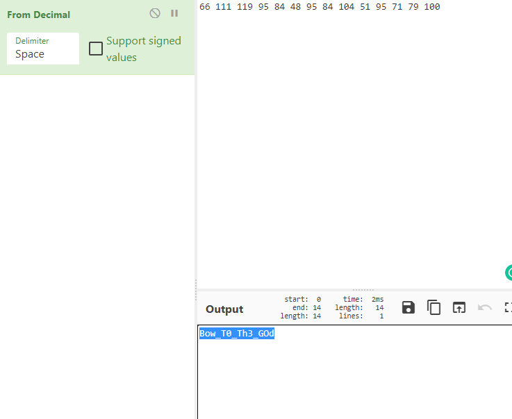

In this challenege we encounter this cipher 

and we get a preety big hint that this cipher is related to Monks so just googling : Monk Cipher we get this image 

And using this image we basically turn this image into numbers like so :

66 111 119 95 84 48 95 84 104 51 95 71 79 100

this seems to me like hex so i basically just use cyberchef now to decrypt this hex code :

