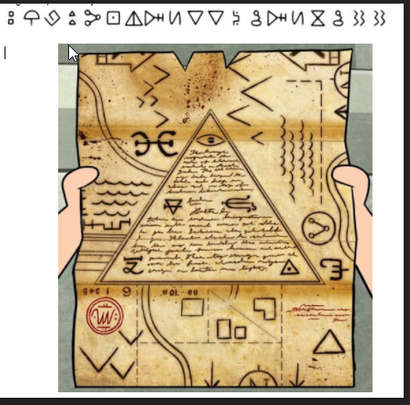
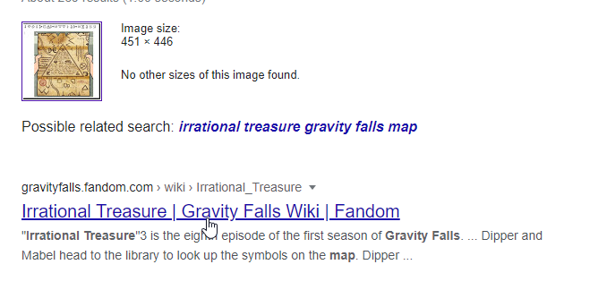
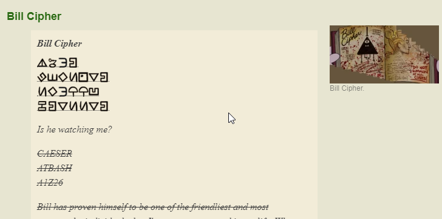

So to start this challenge we get this intresting picture which has a cipher and a map :

So my first guess was to reverse image search the map as it looks from Gravity Falls and maybe we can get some hints from that 

we get this page here : https://gravityfalls.fandom.com/wiki/Journal_3

which lets us know that this is a cipher made by Billy Cipher

and now just searching bill cipher decoder and we can then put in our code 

