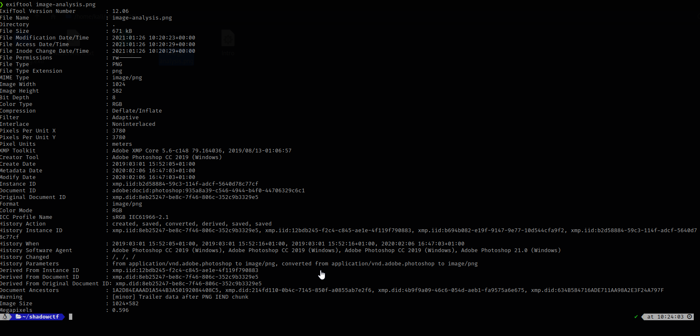

Here we get an image to image analysis on and my first guess is that maybe they added something to the images exif data so we can try using exiftool to get informationn on this image and we get nothing here ,

 so lets try strings and guess what at the strings command we get our flag.